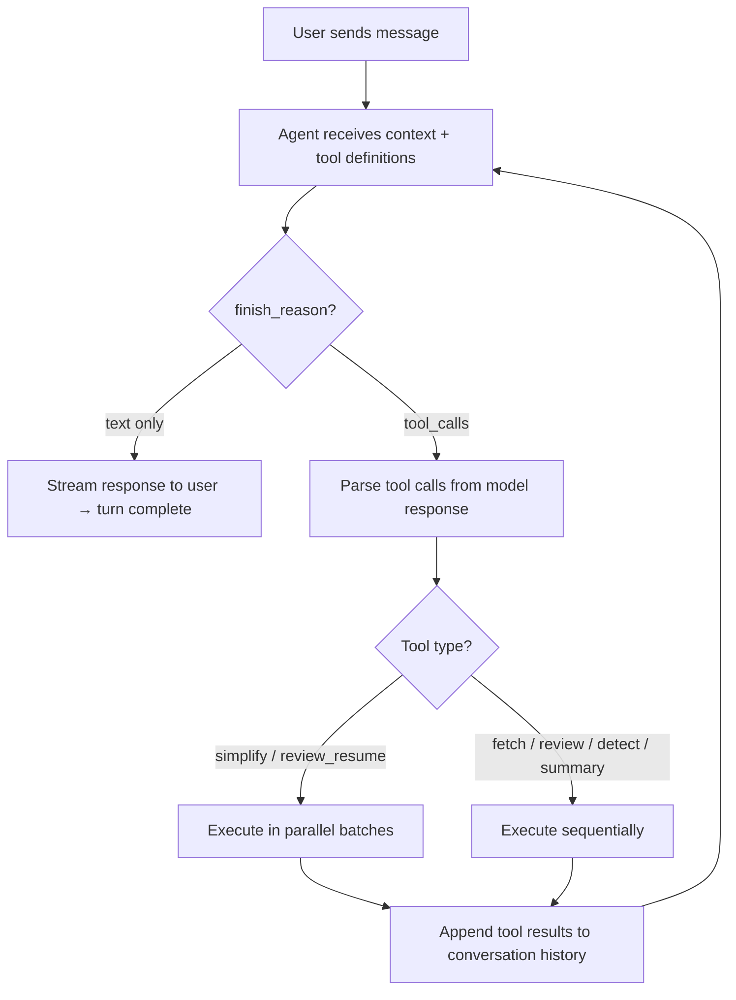
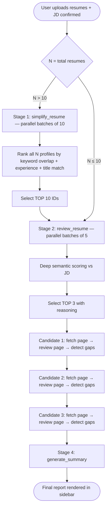
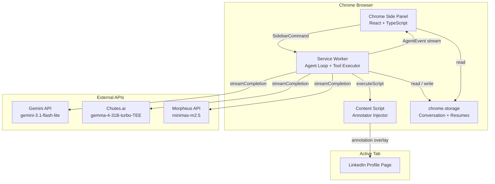
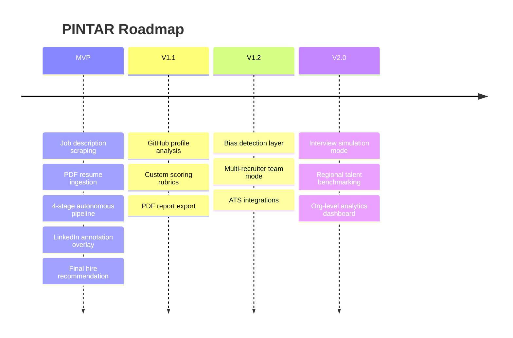

<div align="center">

# 🧠 PINTAR
### *An AI Recruitment Agent That Screens, Ranks, and Profiles Candidates — Autonomously*

<p align="center">
  
  
  
  
  
</p>

<p align="center">
  
  
  
  
  
</p>

---

### PINTAR means **"Smart"** in Malay
A reasoning AI agent embedded in your browser that **reads a job description from any page**, screens an entire applicant pool, deep-reviews the strongest candidates, checks their LinkedIn profiles, and delivers a final hire recommendation — all without a single manual click between steps.

</div>

---

## ✨ Overview

**PINTAR** is a Chrome extension sidebar agent designed to eliminate the most tedious parts of recruitment:

- **Autonomous** → decides which tools to call and when, with no hardcoded button flows
- **Multi-stage** → routes through a 4-stage pipeline scaled to the size of your applicant pool
- **Contextual** → reads the job description directly from your active browser tab
- **Deep** → extracts structured profiles, scores experience quality, cross-validates against LinkedIn
- **Actionable** → delivers a final ranked comparison table with a hire recommendation

> 💡 The insight behind PINTAR:
> If hiring is slow because screening hundreds of resumes is manual, repetitive, and error-prone,
> then the right fix is an agent that **reasons about candidates the same way a senior recruiter would** — not a form you fill out.

---

## 🧠 AI Agent Workflow

PINTAR is a **tool-using reasoning loop**, not a prompt-and-reply chatbot.

On each turn, the model receives the full conversation history, the job description, and the current pipeline state — then decides autonomously which tools to call next, in what order, and with what arguments. The loop runs until the pipeline is complete.



The loop enforces a hard rule: if there is more work to do, the model's response **must** contain tool calls (`finish_reason=tool_calls`). A text-only response (`finish_reason=stop`) ends the turn. This means the pipeline runs to completion automatically — no "click to continue" steps.

---

## 🛠 Tools

PINTAR exposes 7 tools to the model. Each tool is a real function in the service worker — the model decides when to call them.

| Tool | Stage | Execution | Description |
|------|-------|-----------|-------------|
| `fetch_requirements` | Pre-pipeline | Sequential | Scrapes the active browser tab and extracts the job description. No parameters needed — captures the current URL automatically. |
| `simplify_resume` | Stage 1 | **Parallel** (batches of 10) | Lightweight keyword compression for fast initial ranking. Called only when N > 10 resumes. Outputs simplified profiles for scoring. |
| `review_resume` | Stage 2 | **Parallel** (batches of 5) | Deep structured extraction from full resume text. Produces `FullProfile` with skills, experience, education, projects, and links. |
| `fetch_candidate_page` | Stage 3a | Sequential | Scrapes the candidate's LinkedIn profile. Skipped automatically if no LinkedIn URL is found. |
| `review_candidate_page` | Stage 3b | Sequential | Analyzes the fetched LinkedIn content against the job description. Returns verified skills, signals, and red flags. |
| `detect_gaps_and_outcomes` | Stage 3c | Sequential | Deep gap analysis per candidate. Produces annotated strengths, gaps, a 0–100 score, and a `HireRecommendation`. |
| `generate_summary` | Stage 4 | Sequential | Final comparative report across top-3. Returns a ranked comparison table, winner ID, and per-candidate verdicts. |

---

## 🔄 Process Flow

The pipeline adapts dynamically based on how many resumes are uploaded.



---

## ⚙️ Decision Logic

### Stage 1 Routing — based on applicant pool size

| Condition | Stage 1 | Stage 2 Input |
|-----------|---------|---------------|
| **N > 10 resumes** | `simplify_resume` runs for all N, selects **top 10** | top 10 IDs from Stage 1 |
| **N ≤ 10 resumes** | Skipped entirely | all N IDs directly |

> Stage 1 exists purely for efficiency — compressing 50 resumes before deep-reading avoids wasting tokens on clearly irrelevant candidates.

### Parallelism Rules

```
simplify_resume  → always parallel, up to 10 IDs per call
                   e.g. 23 resumes = 3 simultaneous calls: [R001–R010], [R011–R020], [R021–R023]

review_resume    → always parallel, up to 5 IDs per call
                   e.g. 10 candidates = 2 simultaneous calls: [R001–R005], [R006–R010]

Stage 3 (per-candidate analysis) → strictly sequential
                   complete one candidate fully (3a → 3b → 3c) before starting the next
```

### LinkedIn Annotation Injection

After `detect_gaps_and_outcomes` completes for a candidate whose LinkedIn tab is open, PINTAR injects an annotation overlay directly into that tab via `chrome.scripting.executeScript`. Strengths appear as green highlights, gaps as red — without any manual action from the user.

---

## 🌟 Core Features

### Agent Behavior
| Feature | Description |
|--------|-------------|
| **Autonomous tool orchestration** | Model decides when to call tools — no hardcoded flows or button steps |
| **Pipeline continuity enforcement** | System prompt rules prevent text-only responses mid-pipeline; agent can't "pause" without reason |
| **Adaptive routing** | Stage 1 is inserted automatically when the pool exceeds 10; skipped otherwise |
| **Live narration** | Agent streams a one-sentence description of what it's doing before each tool batch |
| **Fallback narration** | If the model skips narration, the agent generates one via a secondary `chatCompletion` call |

### Resume Processing
| Feature | Description |
|--------|-------------|
| **PDF parsing** | Resumes are extracted client-side using `pdfjs-dist` before upload |
| **Persistent resume store** | Uploaded texts survive service worker restarts via `chrome.storage.local` |
| **ID-based reference** | Resumes are stored once under sequential IDs (`R001`, `R002`…) and referenced by ID in tool calls — full text is never duplicated in conversation history |

### Sidebar UI
| Feature | Description |
|--------|-------------|
| **Real-time streaming** | Agent text, thinking tokens, tool badges, and stage indicators update live |
| **Stage indicator** | Header chip shows current pipeline stage with label |
| **Candidate cards** | Intermediate results rendered as structured cards during Stage 3 |
| **Final report panel** | Comparison table with scores, top skills, key gaps, and hire recommendation |
| **LinkedIn annotation** | Strength and gap overlays injected into open LinkedIn tabs |
| **Conversation persistence** | Full conversation history survives service worker restarts |

---

## 🏗 System Architecture



---

## 🧰 Tech Stack

### Extension
- **Chrome Manifest V3** — service worker, side panel, scripting API
- **React 19** — sidebar UI
- **TypeScript 5.8** — full type safety across agent loop and tool types
- **Vite 5 + @crxjs/vite-plugin** — fast dev server with hot-reload for extensions

### AI
- **Google Gemini API** (`gemini-3.1-flash-lite`) — primary reasoning model with native tool use and streaming
- **Chutes.ai** (`google/gemma-4-31B-turbo-TEE`) — alternative provider, same OpenAI-compatible API surface
- **Morpheus API** (`minimax-m2.5`) — third provider via `api.mor.org`, OpenAI-compatible

### Utilities
- **pdfjs-dist 4** — client-side PDF text extraction

---

## 📦 Repository Structure

```
PINTAR/
├── src/
│   ├── background/
│   │   ├── agent-loop.ts           # Core reasoning loop, pipeline state, annotation injection
│   │   ├── tool-definitions.ts     # All 7 tool schemas passed to the model
│   │   ├── tool-executor.ts        # Routes tool calls to implementations
│   │   ├── gemini-client.ts        # Gemini streaming + chat completion
│   │   ├── chutes-client.ts        # Chutes.ai streaming (OpenAI-compatible)
│   │   ├── morpheus-client.ts      # Morpheus streaming (OpenAI-compatible)
│   │   ├── llm-client.ts           # Provider selector (Gemini / Chutes / Morpheus)
│   │   ├── resume-store.ts         # In-memory + storage-persisted resume map
│   │   ├── service-worker.ts       # Message handler, keepalive, abort
│   │   └── tools/
│   │       ├── fetch-requirements.ts    # Scrape active tab for JD
│   │       ├── simplify-resume.ts       # Stage 1: lightweight compression
│   │       ├── review-resume.ts         # Stage 2: deep structured extraction
│   │       ├── fetch-candidate-page.ts  # Stage 3a: scrape LinkedIn
│   │       ├── review-candidate-page.ts # Stage 3b: analyze page vs JD
│   │       ├── detect-gaps.ts           # Stage 3c: gap analysis + scoring
│   │       └── generate-summary.ts      # Stage 4: final comparison report
│   ├── sidebar/
│   │   ├── App.tsx                 # Root UI, stage chips, chat layout
│   │   ├── components/
│   │   │   ├── AgentBubble.tsx     # Streaming bubble with tool badges + think tokens
│   │   │   ├── CandidateCard.tsx   # Per-candidate result card
│   │   │   ├── FinalReport.tsx     # Comparison table + winner panel
│   │   │   ├── InputPanel.tsx      # Chat input with PDF attachment
│   │   │   ├── ThinkingText.tsx    # Animated thinking indicator
│   │   │   └── ToolBadge.tsx       # Tool call / result status chip
│   │   └── hooks/
│   │       └── useAgentStream.ts   # State machine for agent event stream
│   ├── settings/                   # Options page — API key configuration
│   ├── content/
│   │   └── annotator.ts            # LinkedIn annotation overlay injector
│   └── shared/
│       ├── constants.ts            # API URLs, model names, pipeline stage types
│       ├── message-types.ts        # AgentEvent, SidebarCommand, ChatMessage types
│       └── tool-types.ts           # All structured data types (profiles, scores, reports)
├── manifest.json
├── package.json
└── vite.config.ts
```

---

## ⚙️ System Requirements

| Requirement | Version / Details |
|-------------|-------------------|
| **Node.js** | 18 or later |
| **npm** | 9 or later |
| **Chrome** | 114 or later (Side Panel API required) |
| **Gemini API key** | Free tier available at [Google AI Studio](https://aistudio.google.com) |
| **Chutes.ai API key** | *(Optional)* Alternative LLM provider at [chutes.ai](https://chutes.ai) |
| **Morpheus API key** | *(Optional)* Alternative LLM provider at [mor.org](https://mor.org) |

---

## 🚀 Setup Guide

### 1) Clone the Repository

```bash
git clone <repository-url>
cd PINTAR
```

---

### 2) Install Dependencies

```bash
npm install
```

---

### 3) Build the Extension

```bash
npm run build
```

This generates a `dist/` folder containing the built extension.

For development with hot-reload:

```bash
npm run dev
```

> In dev mode, Vite serves the extension files live. You still need to load it into Chrome once (step 4), then changes hot-reload automatically.

---

### 4) Load into Chrome

1. Open Chrome and navigate to `chrome://extensions`
2. Enable **Developer mode** (toggle in the top-right corner)
3. Click **Load unpacked**
4. Select the `dist/` folder inside your PINTAR project directory
5. The PINTAR icon will appear in your Chrome toolbar

---

### 5) Configure Your API Key

1. Click the PINTAR icon in the toolbar to open the side panel
2. Click the **⚙️** button in the header
3. The Settings page will open
4. Choose your preferred provider and paste your API key:

**Getting a Gemini API key:**
1. Go to [Google AI Studio](https://aistudio.google.com/app/apikey)
2. Sign in with your Google account
3. Click **Create API key**
4. Copy the key and paste it into PINTAR Settings

**Getting a Chutes.ai API key:**
1. Sign up at [chutes.ai](https://chutes.ai)
2. Go to your account dashboard
3. Create a new API token and paste it into PINTAR Settings

**Getting a Morpheus API key:**
1. Sign up at [mor.org](https://mor.org)
2. Go to your account dashboard
3. Create a new API token and paste it into PINTAR Settings

5. Click **Save**

---

### 6) Run Your First Analysis

1. Open any job posting page in Chrome (LinkedIn Jobs, Greenhouse, Lever, or a plain job post)
2. Open the PINTAR side panel (click the extension icon)
3. Tell PINTAR to read the job description:
   ```
   Grab the job description from this page
   ```
4. PINTAR confirms what it found — review and confirm:
   ```
   Yes, looks correct. Proceed.
   ```
5. Click the **📎** attachment button and upload one or more PDF resumes
6. Say:
   ```
   Analyze these resumes
   ```
7. PINTAR runs the full 4-stage pipeline automatically and delivers the final ranked report

---

### 7) Alternative — Paste the Job Description Manually

If the job posting is behind a login or on a page PINTAR can't scrape:

```
Here's the job description:

[PASTE JD TEXT HERE]

Now analyze the attached resumes.
```

Attach your PDFs with **📎** in the same message or a follow-up before confirming.

---

## 📊 Pipeline Stage Reference

| Stage | Label | What Happens |
|-------|-------|-------------|
| **Pre-pipeline** | Reading job description… | `fetch_requirements` scrapes the active tab |
| **Stage 1** | Compressing all resumes… | `simplify_resume` runs in parallel batches — **only if N > 10** |
| **Stage 2** | Deep resume review… | `review_resume` deep-reads top candidates in parallel batches of 5 |
| **Stage 3** | Enriching candidate profiles… | Per-candidate: fetch LinkedIn → analyze → gap score (sequential) |
| **Stage 4** | Generating final report… | `generate_summary` produces ranked table + winner recommendation |
| **Done** | Analysis complete | Final report rendered; LinkedIn tabs annotated |

---

## 🔐 Security Notes

### Never commit
- Any file containing your API keys
- `chrome.storage` exports with saved credentials

### API Key Storage
API keys are stored in `chrome.storage.sync` — they sync across your signed-in Chrome profiles but never leave Google's encrypted sync layer.

### Permissions Explained

| Permission | Why PINTAR Needs It |
|-----------|---------------------|
| `sidePanel` | Render the agent UI as a Chrome side panel |
| `storage` / `unlimitedStorage` | Persist conversation history and resume texts across service worker restarts |
| `scripting` | Inject the LinkedIn annotation overlay into open tabs |
| `tabs` / `activeTab` | Read the URL and content of the active tab for `fetch_requirements` |
| `host_permissions: <all_urls>` | Allow `fetch_candidate_page` to scrape LinkedIn profiles on any domain |

---

## 🧪 Troubleshooting

### Extension not appearing in sidebar

- Make sure Chrome is version 114 or later
- Confirm **Developer mode** is enabled at `chrome://extensions`
- Try clicking **Update** on the PINTAR extension card, then reload the page

### "No API key found" error

- Click **⚙️** in the PINTAR header and verify your key is saved
- Check that you selected the correct provider (Gemini, Chutes.ai, or Morpheus)
- Confirm the key is valid in [Google AI Studio](https://aistudio.google.com), the Chutes dashboard, or the Morpheus dashboard

### Service worker keeps restarting

Chrome MV3 service workers idle-timeout after 5 minutes. PINTAR counters this with a keepalive ping during active pipeline runs and persists both conversation history and resume texts to `chrome.storage.local` so they survive restarts transparently.

### Build errors

```bash
rm -rf node_modules dist
npm install
npm run build
```

### LinkedIn annotations not appearing

- Make sure the candidate's LinkedIn tab is open and fully loaded **before** Stage 3 runs
- Chrome may prompt for scripting permission on `linkedin.com` on first use — accept it

---

## 🧭 Future Improvements

### Agent
- [ ] Multi-round interview simulation
- [ ] Bias detection pass before final recommendation
- [ ] Confidence calibration across different seniority levels
- [ ] "Explain this score" deep-dive mode

### Pipeline
- [ ] GitHub profile analysis alongside LinkedIn
- [ ] Structured scoring rubric customization per role
- [ ] Export final report to PDF or Notion

### Platform
- [ ] Firefox support (WebExtensions MV3)
- [ ] Team mode — share analyses across recruiters
- [ ] ATS integrations (Greenhouse, Lever, Workday)

---

## 🗺 Roadmap



---

## 🏆 What Makes PINTAR Different

PINTAR is not a resume keyword scanner.

It combines:

- **Autonomous tool orchestration** — the model drives the workflow, not a script
- **Adaptive pipeline routing** — scales Stage 1 in or out based on pool size automatically
- **Cross-source validation** — resumes cross-checked against live LinkedIn data
- **In-browser annotation** — feedback delivered where recruiters already work
- **Persistent memory** — survives browser restarts without losing context

That makes it a strong example of a project at the intersection of:

- **AI agents with real tool use and decision-making**
- **Productivity tooling for knowledge workers**
- **Browser-native AI integration**
- **Human-in-the-loop decision support**

---

## 🤝 Contributors

```
- Moroz Fedor — Architecture, Agent Loop, Full-Stack Implementation
```

<div align="center">

## 🧠 Tell it what you need. It figures out the rest.
## 📄 Upload the resumes. Walk away. Come back to a ranked shortlist.
## 🎯 From 50 applicants to 3 finalists — in one conversation.

**PINTAR — Recruitment Intelligence, Built Right Into Your Browser.**

</div>
